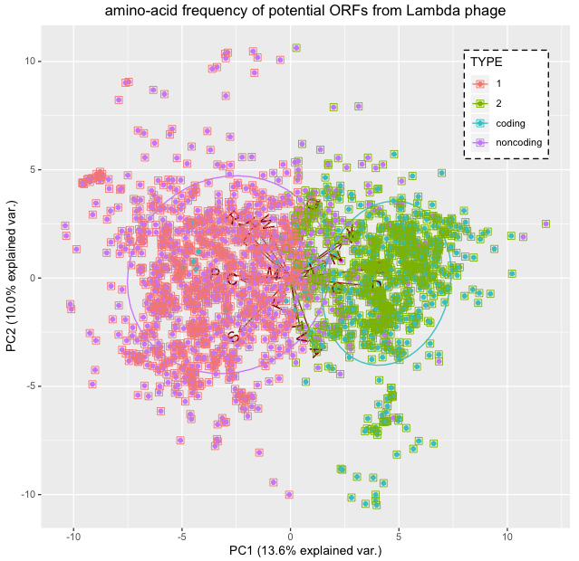
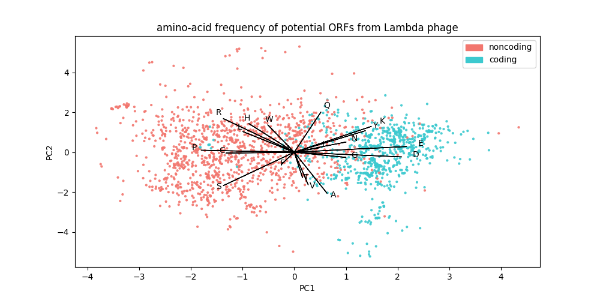

# PCA
This is boilerplate code to create a publication quality figure using principle component analysis.  It is an R script and has the dependency **ggbiplot**, which you can install in R, using the command `install.packages('ggbiplot')`.

## Quick start
```sh
Rscript pca.R
```
or
```sh
python3 pca.py
```


## Input data    
For the example the input file is in the form of tab seperate columns, where the columns A-Z represent amino acid counts.

## Output
If **PCA** ran correctly you should get an output image titled figure.tiff (or figure2.png for python).  If you use the test data, the figure will
look like the image below:
R
___
<p align="center">
    
</p>

Python
___
<p align="center">
    
</p>
